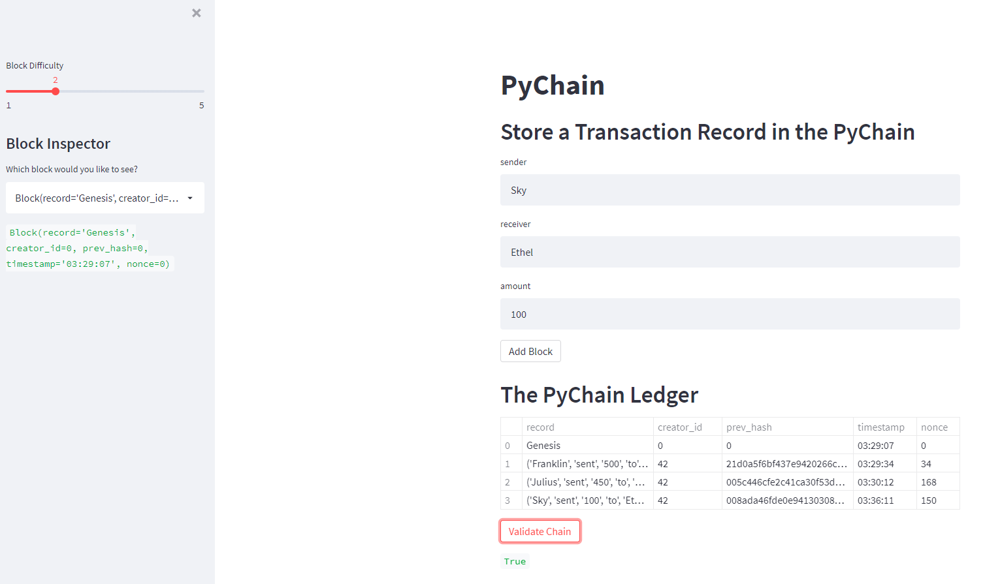
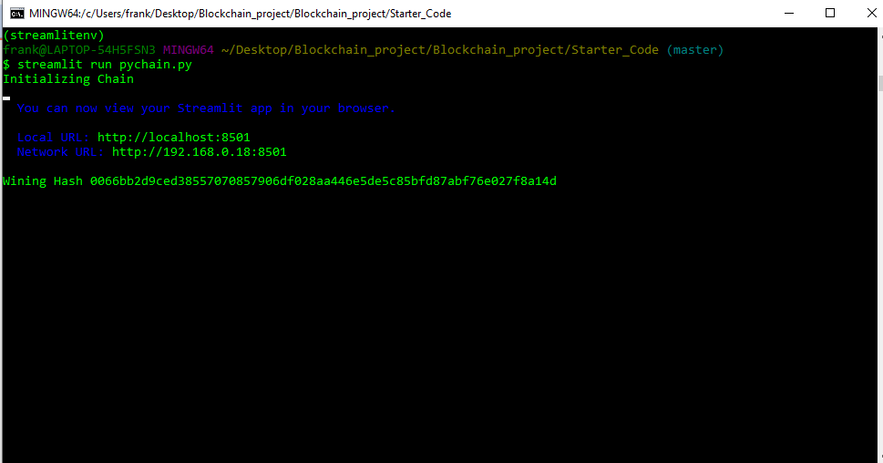

# Blockchain - PyChain Ledger
## By Franklin Vaca

The program/code can be found in the pychian.py file which written using Visual Studio. 
The application was created using streamlit and it can be run using Git Bash or Terminal (Git Bash was used for this project). The pictures presented below are located in the Analysis_images folder within the Starter_code. The screenshots display the application at work, storing new transactions on each new block added to the chain.

## **Application screenshot:**

*PyChain Application* 

 

The PyChain ledger displays the initial block "0" and also three additional blocks that were created by the user identified as "Creatir_id: 42". The timestamp and nonce are also included as part of the blocks.

The Validate Chain button indicates a "True" value which validates the different blocks included in the ledger.

## **Git Bash PyChain Application Information:**

*Git Bash information* 

 

 The chain was initialized and the local and network URLs are displayed for the user to view the Ledger. Also, the wining hash information is available for traceability. No error messages were found.

